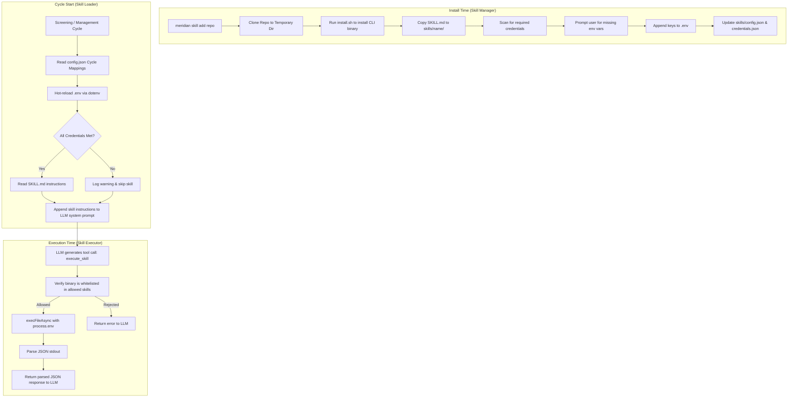
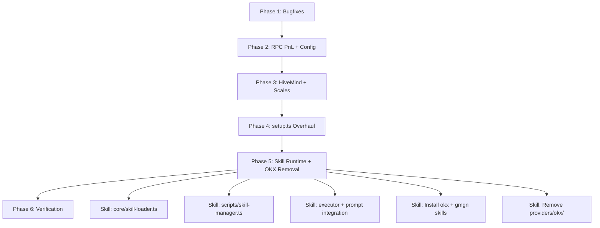

# Upstream Port & Skill Runtime — Implementation Plan

> **Branch:** `ts-structures`
> **Upstream:** `origin/main` (10 commits ahead)
> **Date:** 2026-06-15

---

## Goal Description & Overview

This document outlines the plan to port critical bugfixes, a robust RPC PnL polling engine, GMGN market integrations, and various cleanups from the upstream `origin/main` branch into our local `ts-structures` branch.

It also introduces the **Skill Runtime**—a pluggable subsystem that replaces hardcoded API clients (like OKX and GMGN) with standardized `SKILL.md` instruction files and CLI binaries, preparing the agent for the emerging AI skills ecosystem.

---

## User Review Required

> [!IMPORTANT]
> **OKX Provider Purge**: The hardcoded OKX API client (`providers/okx/`) is deleted. Its safety checks are replaced programmatically by calling the external OKX Skill (`onchainos-skills` running the `onchainos` binary).

> [!WARNING]
> **Dynamic Environment Loading**: Dotenv is configured with `override: true` to support reloading `.env` dynamically when the user manually adds credentials, avoiding bot restarts.

> [!NOTE]
> **CLI Interactive Credentials**: `meridian skill add <repo>` will run interactive CLI prompts asking the user to fill missing keys and append them directly to `.env` if they aren't already set.

---

## Open Questions & Resolved Decisions

1. **Skill binary installation on production servers** — `install.sh` downloads binaries from GitHub releases. On headless servers, this should work but needs testing. Do we want to support Docker-based installation?
   - **Decision:** No Docker support. If a skill requires Docker for binary installation, reject it.

2. **SKILL.md prompt token cost** — Each SKILL.md file adds to the LLM prompt. With many skills installed, this could increase token cost significantly. Should we implement a token budget that limits how many skills can be injected per cycle?
   - **Decision:** Checked the codebase; there is no strict input token budget implemented currently. Only the `maxTokens` output limit is checked (defaulted to 4096 in configuration) along with count-based lesson limits. We will not implement a complex prompt token budget for now, but will rely on cycle-based filtering (injecting only relevant skills per phase/cycle).

3. **Skill versioning** — When a vendor updates their skills, how do we update? `meridian skill update <repo>` would re-clone and overwrite. Do we need version pinning?
   - **Decision:** Skill updates/adds will replace the existing files with the higher version, while taking care not to overwrite credentials/API keys.

4. **Fallback behavior** — If a skill binary is not installed or crashes, the bot continues without it. Is this acceptable for safety-critical skills like `okx-security`, or should we support `failClosed` mode (block deploys if security scan fails)?
   - **Decision:** Skip if the skill tools fail. We will skip failed skills by default and log a warning, but make a note to add a `required` or `failClosed` option as a future enhancement.

5. **GMGN fee source** — Upstream added GMGN as a fee source for `global_fees_sol` in screening. Should this go through the skill runtime (LLM calls `gmgn token info`), or should we keep a lightweight direct API call for this specific metric (since it's called for every candidate, not just LLM-driven)?
   - **Decision:** Keep the lightweight direct GMGN API client same as upstream for global fee checks, and use the skill runtime for general-purpose/LLM-driven actions.

---

## Proposed Changes

### Component 1: Upstream Port

#### [MODIFY] [dlmm.ts](file:///Users/ichadhr/Develop/node/meridian/providers/meteora/dlmm.ts) (Phase 1)
Port validity-based `pnl_pct_suspicious` (price/deposits missing check):
```diff
- const pnlPctSuspicious = pnlPctDiff != null && pnlPctDiff > (config.management.pnlSanityMaxDiffPct ?? 5);
+ const holdsTokenX = xHuman > 0 || feeXHuman > 0;
+ const priceMissing = !(solUsd > 0) || (holdsTokenX && !!f.baseMint && !(priceX > 0));
+ const depositsMissing = (solMode ? depositsSol : depositsUsd) <= 0;
+ const pnlPctSuspicious = priceMissing || depositsMissing;
```
> **Why:** The old diff-based approach compares our fresh PnL against Meteora's cached PnL. On fast moves, the gap inflates and falsely suppresses STOP_LOSS / TRAILING_TP exactly when they matter. The new approach only flags ticks where pricing data is actually missing.

Also wire RPC as primary path in `getMyPositions` during Phase 2.

#### [MODIFY] [close-rules.ts](file:///Users/ichadhr/Develop/node/meridian/core/close-rules.ts) (Phase 1)
Honor `pnl_pct_suspicious` in `getCloseRule()`:
```diff
  // core/close-rules.ts — getCloseRule()
- const pnlSuspect = position.pnl_pct != null
-   && position.pnl_pct < -90
-   && (position.total_value_usd ?? 0) > 0.01;
+ const pnlSuspect = (() => {
+   if ((position as any).pnl_pct_suspicious) return true;
+   if (position.pnl_pct == null) return false;
+   if (position.pnl_pct > -90) return false;
+   return (position.total_value_usd ?? 0) > 0.01;
+ })();
```

#### [MODIFY] [state.ts](file:///Users/ichadhr/Develop/node/meridian/core/live/state.ts) (Phase 1)
Rename `"relay poll"` to `"rpc poll"` in log strings:
```diff
- log("state", `... from relay poll`);
+ log("state", `... from rpc poll`);
```

#### [MODIFY] [types/index.ts](file:///Users/ichadhr/Develop/node/meridian/types/index.ts) (Phase 2)
Define new config types:
```typescript
export interface PnlConfig {
  rpcUrl: string;
  source: "rpc" | "meteora";
  pollIntervalSec: number;
  depositCacheTtlSec: number;
}

export interface GmgnConfig {
  apiKey: string | null;
  baseUrl: string;
  requestDelayMs: number;
  maxRetries: number;
  feeSource: "gmgn" | "jupiter";
}
```

#### [MODIFY] [config/index.ts](file:///Users/ichadhr/Develop/node/meridian/config/index.ts) (Phase 2)
Implement loading for new config properties.

#### [NEW] [pnl.ts](file:///Users/ichadhr/Develop/node/meridian/providers/solana/pnl.ts) (Phase 2)
Implement the RPC PnL engine (`computePositions`) ported from upstream `tools/pnl.js`:
1. `DLMM.getAllLbPairPositionsByUser()` — on-chain read via public RPC.
2. Jupiter price fetch for SOL + base tokens.
3. Meteora `/pnl` API for deposit history (cached by signature + TTL).
4. `buildPosition()` — computes PnL as: `balances + withdrawals + claimable + claimed - deposits`.
5. Returns same shape as `getMyPositions` with `source: "rpc"`.

#### [NEW] [gmgn.ts](file:///Users/ichadhr/Develop/node/meridian/providers/gmgn.ts) (Phase 2)
Implement direct GMGN OpenAPI client for token and pool fee checks.

#### [MODIFY] [token.ts](file:///Users/ichadhr/Develop/node/meridian/providers/jupiter/token.ts) (Phase 2)
Integrate GMGN fees in `resolveGlobalFeesSol`:
```typescript
import { getGmgnTokenFees, hasGmgnApiKey } from "../gmgn.js";

// Inside resolveGlobalFeesSol:
if (config.gmgn.feeSource === "gmgn" && hasGmgnApiKey()) {
  const gmgnFees = await getGmgnTokenFees(mint);
  if (gmgnFees) return gmgnFees.total_fee;
}
// Fallback to Jupiter if GMGN is disabled/unavailable
```

#### [MODIFY] [executor.ts](file:///Users/ichadhr/Develop/node/meridian/llm/tools/executor.ts) (Phase 2)
Add whitelisted config keys to `update_config`:
```typescript
const ALLOWED_CONFIG_KEYS = new Set([
  // ...
  "pnlSource",
  "pnlRpcUrl",
  "gmgnFeeSource",
  "gmgnApiKey"
]);
```

#### [NEW] [gmgn-config.example.json](file:///Users/ichadhr/Develop/node/meridian/gmgn-config.example.json) (Phase 2)
Create a standalone config template:
```json
{
  "apiKey": null,
  "baseUrl": "https://openapi.gmgn.ai",
  "requestDelayMs": 2500,
  "maxRetries": 2,
  "feeSource": "jupiter"
}
```

#### [MODIFY] [secure-env.ts](file:///Users/ichadhr/Develop/node/meridian/utils/secure-env.ts) (Phase 2)
Set dotenv env loading override to true.

#### [MODIFY] [sync.ts](file:///Users/ichadhr/Develop/node/meridian/providers/hivemind/sync.ts) (Phase 3)
Implement `buildMarketFields()` to push market metrics (TVL, volume, entry/exit mcap) during performance sync.

#### [NEW] [screening-scales.ts](file:///Users/ichadhr/Develop/node/meridian/core/screening-scales.ts) (Phase 3)
Implement timeframe-aware screening thresholds (scaling minimum volume and organic thresholds based on screening interval).

#### [MODIFY] [setup.ts](file:///Users/ichadhr/Develop/node/meridian/setup.ts) (Phase 4)
* Add interactive config wizard prompts for trailing TP, gas reserves, per-role models, SOL display mode, and TVL ranges.
* Remove deprecated keys (`takeProfitFeePct`, `maxBundlePct`, `athFilterPct`).

---

### Component 2: Skill Runtime & OKX Purge (Phase 5)

This component replaces hardcoded provider directories with a pluggable, generic skill runtime.

#### Skill Lifecycle Flow



#### [DELETE] [okx](file:///Users/ichadhr/Develop/node/meridian/providers/okx/)
Delete `providers/okx/` folder entirely.

#### [NEW] [skill-loader.ts](file:///Users/ichadhr/Develop/node/meridian/core/skill-loader.ts)
Reads and filters skills from `skills/` directory on a per-cycle basis.
```typescript
import dotenv from "dotenv";

function isSkillReady(name: string): { ready: boolean; missing: string[] } {
  // Hot-reload .env from disk so manual updates are detected without restarts
  dotenv.config({ override: true });

  const creds = loadCredentials()[name];
  if (!creds) return { ready: true, missing: [] };

  const missing = creds.required.filter(
    (envVar: string) => !process.env[envVar]
  );
  return { ready: missing.length === 0, missing };
}
```

#### [NEW] [skill-manager.ts](file:///Users/ichadhr/Develop/node/meridian/scripts/skill-manager.ts)
CLI commands for adding, removing, and listing skills.
```typescript
async function addSkill(repo: string, options?: { only?: string[] }) {
  const tmpDir = path.join(ROOT, ".skill-tmp");
  // Clone, run install.sh, copy SKILL.md, detect & prompt credentials, cleanup
}
```

#### [NEW] [config.json](file:///Users/ichadhr/Develop/node/meridian/skills/config.json)
Maps cycle names to enabled skills.
```json
{
  "screening": ["okx-security", "okx-dex-trenches", "gmgn-token"],
  "management": ["gmgn-portfolio"],
  "safety": ["okx-security"],
  "general": ["*"]
}
```

#### [NEW] [credentials.json](file:///Users/ichadhr/Develop/node/meridian/skills/credentials.json)
Stores metadata about required credentials per skill.

#### [MODIFY] [prompt.ts](file:///Users/ichadhr/Develop/node/meridian/llm/prompt.ts)
Inject skill instructions dynamically into the system prompt.

#### [MODIFY] [definitions.ts](file:///Users/ichadhr/Develop/node/meridian/llm/tools/definitions.ts)
Add `execute_skill` tool definition.

#### [MODIFY] [executor.ts](file:///Users/ichadhr/Develop/node/meridian/llm/tools/executor.ts)
Execute external CLI commands when the LLM requests it.
```typescript
case "execute_skill": {
  const command = args.command as string;
  const parts = command.split(/\s+/);
  const binary = parts[0];
  const allowedBinaries = getInstalledSkillBinaries();
  if (!allowedBinaries.includes(binary)) {
    return { error: `Binary '${binary}' not allowed.` };
  }
  const { stdout } = await execFileAsync(binary, parts.slice(1), {
    timeout: 15_000,
    env: { ...process.env },
    maxBuffer: 10 * 1024 * 1024
  });
  return JSON.parse(stdout);
}
```
Also implements a mandatory pre-deploy security scanner loop inside the safety check gating:
```typescript
const safetySkills = getSkillsForCycle("safety");
for (const skill of safetySkills.skills) {
  const result = await executeSkillCommand(skill.getSecurityCommand(args.base_mint));
  if (result?.is_honeypot) return { pass: false, reason: "Honeypot" };
}
```

#### [MODIFY] [cli.ts](file:///Users/ichadhr/Develop/node/meridian/cli.ts)
Wire `meridian skill add/remove/list` subcommands.

---

## Execution Order



### Phase 5 detailed order:
1. Build `core/skill-loader.ts` (load, filter, credentials check).
2. Build `scripts/skill-manager.ts` (add/remove/list CLI handler).
3. Wire `execute_skill` tool in definitions + executor.
4. Modify `llm/prompt.ts` for skill injection.
5. Add mandatory safety check flow in executor.
6. Wire CLI subcommands in `cli.ts`.
7. Install skills: `meridian skill add okx/onchainos-skills`
8. Install skills: `meridian skill add GMGNAI/gmgn-skills`
9. Test skill execution in dry-run mode.
10. Remove `providers/okx/` (all 42 references).
11. Implement lightweight direct GMGN API client for global fee checks (`providers/gmgn.ts`).

---

## Verification Plan

### Automated Tests
* Run TypeScript compiler verification:
  ```bash
  npm run typecheck
  ```
* Run test suites:
  ```bash
  npm run test
  ```

### Manual Verification
* Run a dry-run screening cycle to ensure the injected skills and prompt additions function:
  ```bash
  npm run dev
  ```
* Test CLI commands:
  ```bash
  meridian skill list
  meridian skill add GMGNAI/gmgn-skills
  ```
